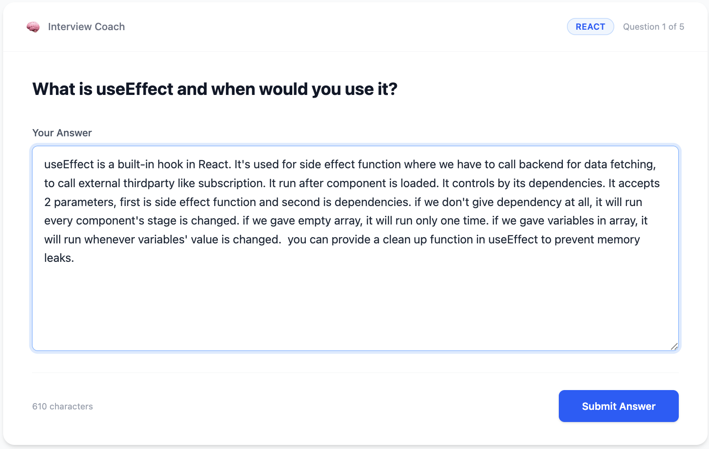
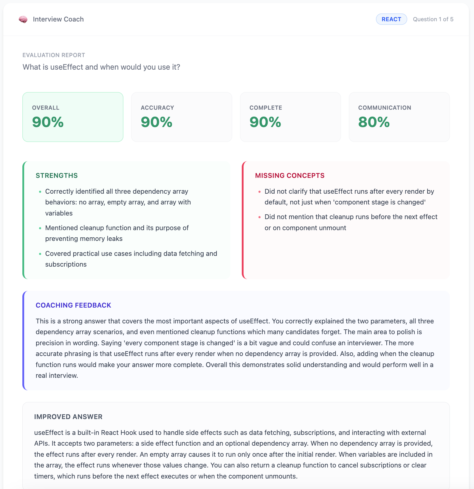
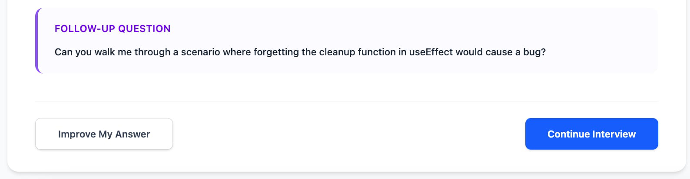

# Interview Coach AI

> An AI-powered technical interview practice platform that helps developers improve their understanding, explanation skills, and interview confidence through interactive coaching powered by Claude.

---

## Screenshots

### Interview Question

<p align="center">
  
</p>

### AI Evaluation & Follow-up Question

<p align="center">
  
</p>
<p align="center">
  
</p>

---

## Overview

Many developers understand technical concepts but struggle to explain them clearly during interviews.

Interview Coach AI focuses on improving communication and understanding rather than memorization. Users answer technical interview questions in their own words, and the AI evaluates their explanations, identifies knowledge gaps, provides constructive feedback, and suggests follow-up questions similar to a real technical interview.

This project is built as a Weekend MVP to demonstrate:

- Claude API Integration
- Agent-based Architecture
- Skills-based Learning
- MCP (Model Context Protocol)
- Retrieval-Augmented Generation (RAG)

---

## Problem Statement

Technical interviews often require candidates to explain concepts clearly under pressure.

Examples:

- What is `useEffect`?
- What is a Higher Order Function (HOF)?
- What is the difference between `PUT` and `PATCH`?
- How do `async` and `await` work?

Candidates may understand these topics but struggle to articulate their knowledge during interviews.

This project helps users practice explaining concepts and receive immediate feedback.

---

## Features (MVP)

### Interview Question Practice

Users can:

- Select a topic
- Answer interview questions
- Practice explaining concepts in their own words

### AI Evaluation

Claude evaluates:

- Technical accuracy
- Completeness
- Communication clarity
- Interview readiness

### Feedback & Coaching

Claude provides:

- Strengths
- Missing points
- Improved answer examples
- Follow-up interview questions

### Personalized Learning

Based on user performance, the system recommends:

- Topics to review
- Weak areas
- Suggested learning paths

---

## Architecture

```text
┌─────────────────┐
│ React Frontend  │
└────────┬────────┘
         │
         ▼
┌─────────────────┐
│ Express Backend │
└────────┬────────┘
         │
         │
         ▼
┌────────────────────────────────┐
│ Interview Coach Agent          │
├────────────────────────────────┤
│ Question Generation            │
│ Answer Evaluation              │
│ Coaching Feedback              │
│ Study Planning                 │
└────────┬───────────────────────┘
         │
         ├────────────────────┐
         ▼                    ▼
┌─────────────────┐   ┌─────────────────┐
│ Claude API      │   │ Google Sheets   │
└─────────────────┘   │ MCP Server      │
                      └────────┬────────┘
                               ▼
                      ┌─────────────────┐
                      │ Knowledge Base  │
                      │ Interview Notes │
                      └─────────────────┘

```

---

## Methodology

### Retrieval-Augmented Generation (RAG)

Instead of relying solely on Claude's general knowledge, the application retrieves relevant interview notes from Google Sheets.

### Workflow

1. User selects a topic.
2. System retrieves related notes from Google Sheets.
3. Claude receives the retrieved context.
4. Claude generates questions and evaluates answers.
5. Claude provides personalized feedback.

### Benefits

- Personalized learning experience
- Consistent explanations
- Uses user-curated interview notes
- Reduces hallucinations

---

## Interview Topics

The Interview Coach currently supports the following technical interview topics:

### React

Topics:

- useEffect
- useMemo
- useCallback
- Context API
- Component Lifecycle

### JavaScript

Topics:

- Closures
- Higher Order Functions
- Promises
- Event Loop
- Async/Await

### API

Topics:

- REST APIs
- Authentication
- PUT vs PATCH
- HTTP Status Codes

Each topic contains interview questions, expected concepts and evaluation notes stored in Google Sheets.

---

## Claude Skill

### Evaluate Answer

Purpose:

- Evaluate interview answers
- Score technical accuracy
- Identify missing concepts
- Generate coaching feedback
- Suggest follow-up questions

Input:

- Question
- User Answer
- Retrieved Notes

Output:

- Scores
- Feedback
- Improved Answer
- Follow-up Question

---

## Agents

### Current Agent

- Interview Coach Agent

The Interview Coach Agent currently combines four responsibilities:

- Question Generation
- Answer Evaluation
- Coaching Feedback
- Study Planning

Future versions may split these responsibilities into separate agents.

---

## MCP Integration

### Google Sheets MCP Server

Purpose:

Store and retrieve interview preparation notes.

### Example Tabs

- JavaScript
- React
- TypeScript
- APIs
- Databases

### Current Capabilities

- Read interview notes
- Retrieve topic content
- Provide contextual knowledge for interview questions

### Future Capabilities

- Track practice history
- Store scores

### Example Query

```text
Start a React interview session.
```

System will:

1. Read the React tab.
2. Retrieve notes and expected concepts.
3. Generate questions.
4. Evaluate answers.
5. Return coaching feedback.

---

## User Flow

### Practice Session

1. User clicks **Start Interview**
2. Frontend requests a question from the backend
3. Backend retrieves relevant notes from Google Sheets
4. Interview Coach Agent generates a question
5. User submits an answer
6. Backend calls Claude using the Evaluate Answer Skill
7. Feedback and scores are displayed
8. User chooses:
   - Improve My Answer
   - Continue Interview

---

## Tech Stack

### Frontend

- React
- TypeScript
- Tailwind CSS

### Backend

- Node.js
- Express.js
- Anthropic SDK
- dotenv

### AI

- Claude API

### Knowledge Source

- Google Sheets

### MCP

- Google Sheets MCP Server

### Deployment

- Vercel (Frontend)
- Railway or Render (Backend)

---

## Example Scenario

### Question

```text
What is useEffect?
```

### User Answer

```text
useEffect is used when component renders.
```

### Claude Feedback

#### Strengths

- Correct basic understanding

#### Missing Points

- Side effects explanation
- Dependency array behavior
- Common use cases

#### Interview Score

```text
60%
```

#### Improved Answer

```text
useEffect is a React Hook used to perform side effects such as API calls, subscriptions, and DOM updates. It runs after render and can be controlled using the dependency array.
```

#### Follow-up Question

```text
What happens when the dependency array is empty?
```

---

## Future Enhancements

- Voice interview mode
- Speech-to-text answers
- Mock interview simulation
- Coding challenge evaluation
- Interview history dashboard
- AI-generated learning plans
- Role-specific interviews (Frontend, Backend, Full Stack)

---

## Success Criteria

The MVP is successful if a user can:

- Practice interview questions
- Receive AI-generated feedback
- Review knowledge from Google Sheets
- Identify weak areas
- Improve explanation skills

---

## Author

**Sandar Min Aye**
[Visit LinkedIn](https://www.linkedin.com/in/sandar-min-aye/)

Building practical AI tools to improve technical interview confidence and learning effectiveness.
