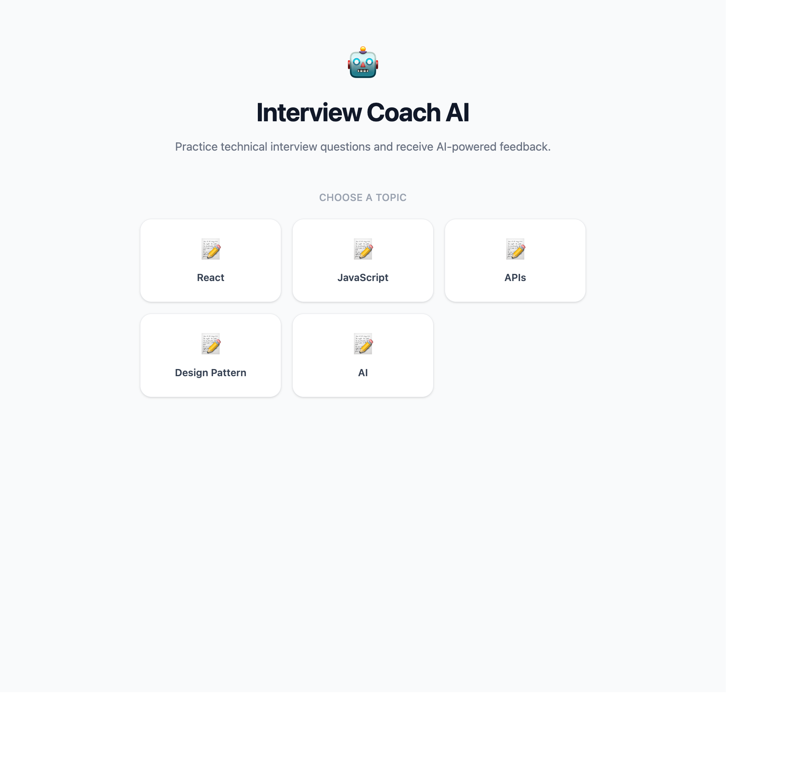
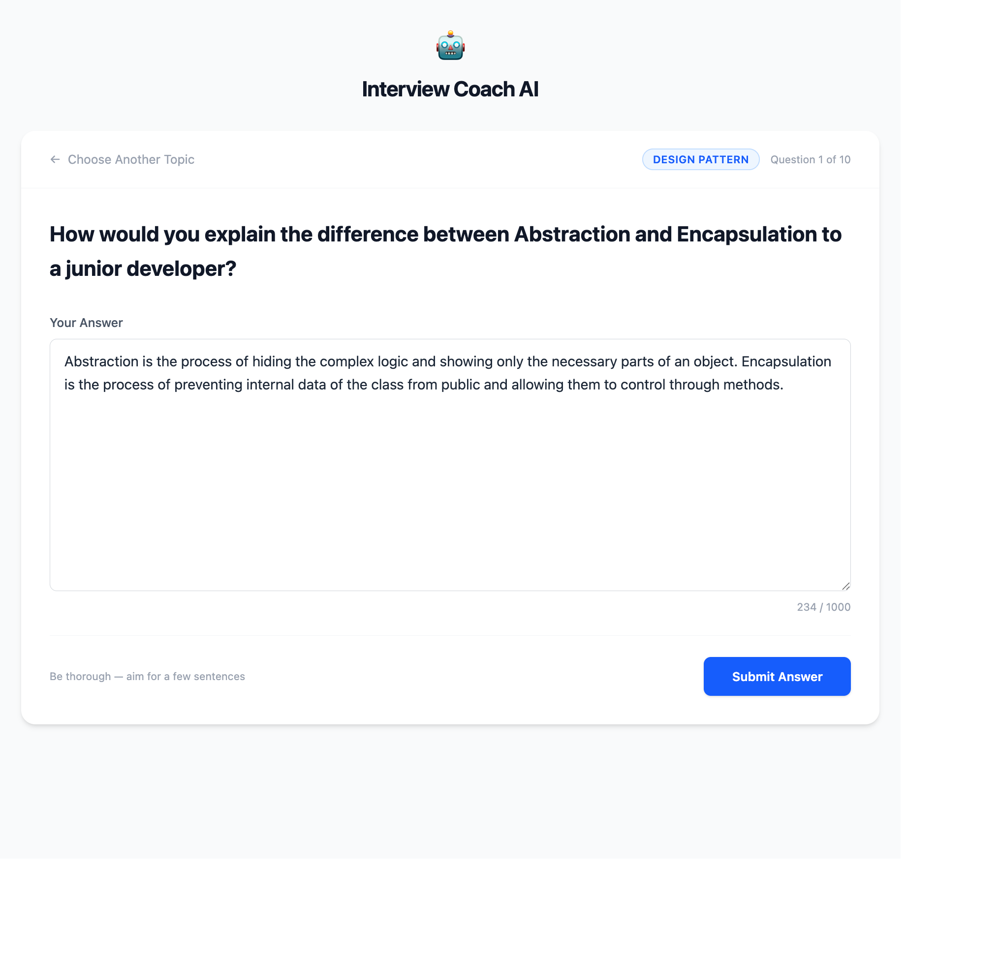
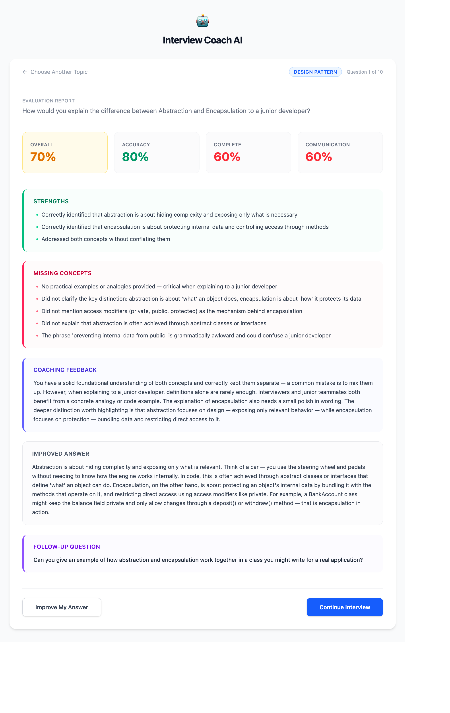

# Interview Coach AI

> An AI-powered technical interview practice platform that helps developers improve their understanding, explanation skills, and interview confidence through interactive coaching powered by Claude.

---

If this project helped you prepare for interviews,
please consider giving it a ⭐ on GitHub — it means a lot!

👉 [Star this repo](https://github.com/sandarma/Interview-Coach-AI)

---

## Live Demo

🔗 **[https://interview-coach-ai-rouge.vercel.app/](https://interview-coach-ai-rouge.vercel.app/)**

This app runs on a small budget — please use it mindfully 🙏 .

---

## Screenshots

### Topic Selection Screen

<p align="center">
  
</p>

### AI Generating Questions & Evaluation Screen

<p align="center">
  
</p>
<p align="center">
  
</p>

---

## Overview

Many developers understand technical concepts but struggle to explain them clearly during interviews.

Interview Coach AI helps users practice explaining technical concepts in their own words. The AI evaluates their explanations, identifies knowledge gaps, provides constructive feedback, and suggests follow-up questions — similar to a real technical interviewer.

This project is built as a Weekend MVP to demonstrate:

- Claude API Integration
- Retrieval-Augmented Generation (RAG)
- Google Sheets as a Knowledge Base

---

## Features

### Topic Selection

- Dynamic topic loading from Google Sheets tabs
- Topics are the single source of truth — add a tab, get a new topic

### AI Question Generation

- Claude generates 10 interview questions per topic based on study notes
- Questions vary in difficulty (easy, medium, hard)
- Questions test understanding, not memorization

### Answer Evaluation

Claude evaluates answers on three dimensions:

- **Technical Accuracy** — Is the explanation correct?
- **Completeness** — Are key concepts covered?
- **Communication** — Would this work in a real interview?

### Coaching Feedback

After each answer, Claude provides:

- Strengths
- Missing concepts
- Improved answer example
- Follow-up question

### Security

- Prompt injection protection — user answers are wrapped in delimiters
- Claude is instructed to never reveal system prompts or internal details

---

## Architecture

```text
┌─────────────────┐
│ React Frontend  │
└────────┬────────┘
         │
         ▼
┌─────────────────┐
│ Express Backend │
└────────┬────────┘
         │
         ├────────────────────┐
         ▼                    ▼
┌─────────────────┐   ┌─────────────────┐
│ Claude API      │   │ Google Sheets   │
│ (Questions +    │   │ (Notes)         │
│  Evaluation)    │   │                 │
└─────────────────┘   └─────────────────┘
```

### How It Works

1. User selects a topic
2. Backend reads notes from Google Sheets
3. Claude generates 10 questions from the notes
4. User answers a question
5. Claude evaluates the answer and provides feedback
6. User continues or improves their answer

---

## Tech Stack

### Frontend

- React 19
- TypeScript
- Tailwind CSS 4
- Vite

### Backend

- Node.js
- Express 5
- TypeScript

### AI

- Claude API (claude-sonnet-4-6)
- Two skills: `evaluate-answer`, `generate-questions`

### Knowledge Source

- Google Sheets (via `googleapis` npm package)
- In-memory caching (10 min for questions, 1 hour for topics)

### Deployment

- Vercel (Frontend)
- Railway or Render (Backend)

---

## Getting Started

### Prerequisites

- Node.js 18+
- npm
- Anthropic API key
- Google Sheet with interview notes
- Google Cloud service account with Sheets API access

### Clone the Repository

```bash
git clone https://github.com/your-username/interview-coach.git
cd interview-coach
```

### Frontend Setup

```bash
# Install dependencies
npm install

# Start development server
npm run dev
```

The frontend runs on `http://localhost:5173` by default.

### Backend Setup

```bash
# Navigate to backend directory
cd backend

# Install dependencies
npm install

# Create environment file
cp .env.example .env
```

Edit `backend/.env` with your credentials:

```text
PORT=3001
ANTHROPIC_API_KEY=your-anthropic-api-key
GOOGLE_SHEET_ID=your-google-sheet-id
CLIENT_SERVICE_ACCOUNT_EMAIL=your-service-account@project.iam.gserviceaccount.com
CLIENT_SERVICE_ACCOUNT_KEY=your-private-key
```

Start the backend server:

```bash
# Development
npm run dev

# Production
npm run build
npm start
```

The backend runs on `http://localhost:3001` by default.

### Google Sheet Structure

Create a Google Sheet with tabs for each topic:

```text
Interview Notes
├── React
├── JavaScript
├── TypeScript
├── APIs
└── Databases
```

Each tab should have interview notes in column B (starting from row 2).

---

## Example Scenario

### Question

```text
What is useEffect?
```

### User Answer

```text
useEffect is used when component renders.
```

### Claude Feedback

#### Score: 60%

#### Strengths

- Correct basic understanding

#### Missing Concepts

- Side effects explanation
- Dependency array behavior
- Common use cases

#### Improved Answer

```text
useEffect is a React Hook used to perform side effects such as API calls,
subscriptions, and DOM updates. It runs after render and can be controlled
using the dependency array.
```

#### Follow-up Question

```text
What happens when the dependency array is empty?
```

---

## API Endpoints

| Method | Endpoint        | Description                                      |
| ------ | --------------- | ------------------------------------------------ |
| `POST` | `/api/question` | Get a question (`{topic, questionIndex}`)        |
| `POST` | `/api/evaluate` | Evaluate an answer (`{topic, question, answer}`) |
| `GET`  | `/api/topics`   | List available topics                            |
| `GET`  | `/api/health`   | Health check                                     |

---

## Author

**Sandar Min Aye**
[Visit LinkedIn](https://www.linkedin.com/in/sandar-min-aye/)

Building practical AI tools to improve technical interview confidence and learning effectiveness.
